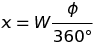
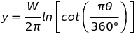
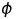
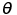
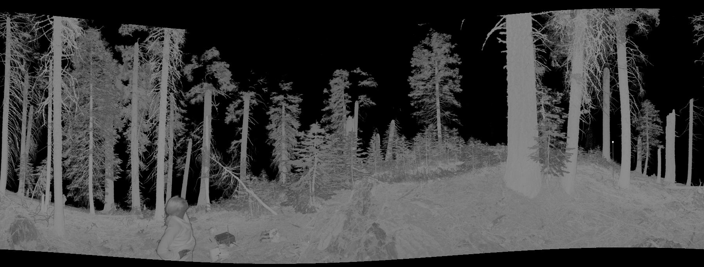

# tls_3d_to_2d

CLI tool for transforming [Hancock terrestrial LiDAR binary polar format](https://bitbucket.org/StevenHancock/libclidar) to 2D image for quick inspection.

## Description

This tool will project the 3D TLS polar point format to 2D format. The projection considers the point cloud as approximately spherical around the sensor, and projects it to a cylinder, just like the mercator projection. So the equations for calculating x and y are:





Where:

* W: projected image width
* : azimuth in degrees
* : zenith in degrees

From those equations we can project `x` and `y` coordinates to a gridded image, the pixel values will correspond to the average of the reflectance values of all pixels belonging to that cell.

## Usage

### Basic

    tls_3d_to_2d -z 35 -Z 125 -d 0 -D 40 --output output.png input_file.bin

It will project the cloud point from 0 to 40 meters horizontal distance from sensor and from 35 to 125 degrees of zenith. If min zenith is 0 degrees, it will lead to the calculation of cot(0 degrees) which is infinity thus leading the program to panic.


### Multiple frames

We can use it to produce a video from multiple frames walking through the point cloud from one distance to another. The usage is:

    tls_3d_to_2d -z 35 -Z 125 --mult-frames 120 --mult-dist-from 0 --mult-dist-to 30 --sigma 1 --mult-range-view 8 --output output.png input_file.bin


It will output 120 frames (`--mult-frames 120`) walking from distance 0 (`--mult_dist_from 0`) to 30 (`--mult_dist_to 30`), using a gaussian smoothing factor sigma of 1 (`--sigma 1`) with a visible range of 8 meters (`--mult-range-view 8`). The algorithm will:

1. For `i` in 0 to 30, splitted in 120 parts:
    1. Let `i` be the mid distance
    1. Calculate minimum distance: `i - (range_view/2)`
    1. Calculate maximum distance: `i + (range_view/2)`
    1. Project to 2D the points between minimum and maximum distances
    1. Do gaussian smooth by horizontal distance: mean = `i` and sigma defined by `--sigma or -s OPTION`
    1. Create an image as `OUTPUT_NAME.{n}.png`, where `{n}` will be replaced by numbers from 0 to 119 for each step.


#### Coloring other than grayscale

You should be able to transform grayscale png output format to false color using something like [imagemagick](https://imagemagick.org/), for instance. The command line would be somethink like:

    convert {INPUT_FILE} -normalize ( xc:black xc:red xc:yellow xc:blue +append -filter Cubic -resize 600x1! ) -clut {OUTPUT_FILE} 

This would convert the {INPUT_FILE} grayscale to a black->red->yellow->blue scale. But if you are going this way you should be careful to actually not apply the gaussian to the grayscale images, instead you should use the `--split` or `-S` flag to split the output images between the `reflectance` part and the `gaussian_weigths`, the files should be named {OUTPUT_FILE}.{n}.png for the reflectance data and {OUTPUT_FILE}.{n}.g.png for the gaussian weights. Then you can first apply the false color to the reflectance data as explained previously and then fade it out by the *.g.png gaussian weight using something like:

    convert {INPUT_REFLECTANCE_FALSE_COLOR_FILE} {INPUT_GAUSSIAN_WEIGHTS} -compose multiply -layers flatten {OUTPUT_FILE}


#### Creating a video file

There are many solutions for converting sequential images to video files, I've used ffmpeg for that, with the following command line:

    ffmpeg -start_number 0 -i {INPUT_IMAGE_PATTERN} -c:v libx264 -vf "fps=23,format=yuv420p,pad=width=ceil(iw/2)*2:height=ceil(ih/2)*2" {OUTPUT.mp4}

The strange part `pad=width=ceil(iw/2)*2:height=ceil(ih/2)*2` will handle odd heights and widths, or else it could fail. The {INPUT_IMAGE_PATTERN} should be something like `images_%3d.png` which will match files with prefix `images_` + three digits number + `.png`.


## Note

This is a command line tool, it can accept multiple files and will run in parallel.


## Example

```
$ cargo install tls_3d_to_2d
$ tls_3d_to_2d --help
3d-to-2d 0.3.0

USAGE:
    tls_3d_to_2d [FLAGS] [OPTIONS] --output <output> [file]...

FLAGS:
    -h, --help        Prints help information
    -p, --progress
    -S, --split       Save splitted gauss weights and reflectance images (see README)
        --version     Prints version information

OPTIONS:
    -D, --dist-max <dist-max>                  Maximum distance [default: 20.0]
    -d, --dist-min <dist-min>                  Minimum distance [default: 0.0]
    -f, --mult-dist-from <mult-dist-from>      From distance (multiple images, see readme) [default: -1.0]
    -F, --mult-dist-to <mult-dist-to>          To distance (multiple images, see README) [default: -1.0]
    -t, --mult-frames <mult-frames>            Total frames (multiple images, see README) [default: 120]
    -V, --mult-range-view <mult-range-view>    Range view (multiple images, see README) [default: 6.0]
    -n, --n-threads <n-threads>                Number of threads to run multiple files in parallel [default: 0]
    -o, --output <output>                      Output file name
    -s, --sigma <sigma>                        Sigma gaussian smoothing factor from range center [default: 0.0]
    -w, --width <width>                        Azimuth pixel resolution [default: 1800]
    -Z, --zen-max <zen-max>                    Maximum zenith [default: 120.0]
    -z, --zen-min <zen-min>                    Minimum zenith [default: 30.0]

ARGS:
    <file>...    Input file list space separated
```


## Output example:


[](https://photos.google.com/share/AF1QipPbgEoMqxw0cYPxQEF5lgGVobf02Shc8ArY1XwoZ_9SHd732I9NFHRWrgTWBid3vA/photo/AF1QipNBaKi2y3oUkcM1jyNivXMPeGa1F5f8EH-xk4Lj?key=NmFmaU0xOGk4ZWxOS2xMSHBYMnh2aU00eDB5UzF3)
